<div align="center">


<h1>Kubecost Enterprise Platform</h1>

<p><strong>The Institutional-Grade Platform for Kubernetes Cost Intelligence, FinOps Governance, and Multi-Cloud Cloud-Native Optimization</strong></p>

[]()
[]()
[]()
[]()

<br/>

> **"Visibility is the first step toward optimization."** 
> Kubecost Enterprise is a flagship solution for modern Platform Engineering and FinOps organizations. By orchestrating real-time cost allocation, predictive forecasting, and automated resource optimization, it eliminates cloud waste and ensures that Kubernetes investments deliver maximum business value.

</div>

---

## 🏛️ Executive Summary

The **Kubecost Enterprise Platform** is a specialized flagship solution designed for Cloud Architects, FinOps Practitioners, and Platform Leaders. Cloud-native infrastructure, particularly Kubernetes, introduces unprecedented complexity in cost management due to its dynamic nature and shared resource model.

This platform provides a **Unified Cost Intelligence Plane**. It demonstrates how to orchestrate institutional FinOps—using **FastAPI**, **React 18**, and **Predictive Analytics**—to create a "Cost-Aware" culture. By providing **Namespace-Level Allocation**, **Predictive Forecasting**, and **Automated Rightsizing**, it enables organizations to move from "Blind Spending" to "Unit Economic Maturity."

---

## 📉 The "Cloud Waste" Problem

Enterprises scaling cloud-native workloads face existential challenges:
- **Allocation Gaps**: Difficulty mapping shared Kubernetes cluster costs back to specific business units, products, or teams.
- **Resource Inefficiency**: Massive over-provisioning of CPU and Memory (often 40-60% waste) due to a lack of visibility and automated recommendations.
- **Billing Lag**: Cloud provider billing files (CUR) are often delayed, preventing real-time response to cost anomalies.
- **Budget Overruns**: Lack of automated governance and alerting leads to unexpected month-end billing surprises.

---

## 🚀 Strategic Drivers & Business Outcomes

### 🎯 Strategic Drivers
- **Cost Allocation (Showback/Chargeback)**: Attributing 100% of cluster costs (including idle, system, and common services) to relevant namespaces and labels.
- **Predictive FinOps**: Using time-series forecasting to predict future spend based on historical trends and growth patterns.
- **Resource Optimization**: Automating the detection of idle resources and providing data-driven rightsizing recommendations.

### 💰 Business Outcomes
- **30% Reduction in Kubernetes Spend**: Identifying and eliminating waste through rightsizing and scaling optimizations.
- **100% Cost Transparency**: Providing engineering and finance teams with a single source of truth for cloud-native costs.
- **Institutional Governance**: Enforcing cost policies and budget guardrails to ensure fiscal responsibility across the fleet.

---

## 📐 Architecture Storytelling: 80+ Advanced Diagrams

### 1. Executive Cost Intelligence Architecture
*The orchestration of telemetry, billing, and optimization.*
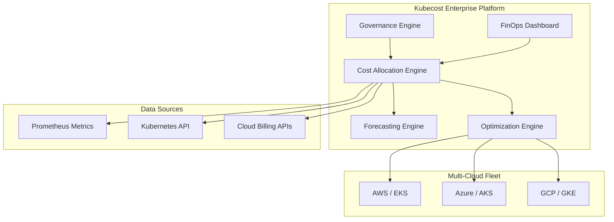

### 2. The Cost Allocation Pipeline
*From raw telemetry to allocated dollars.*
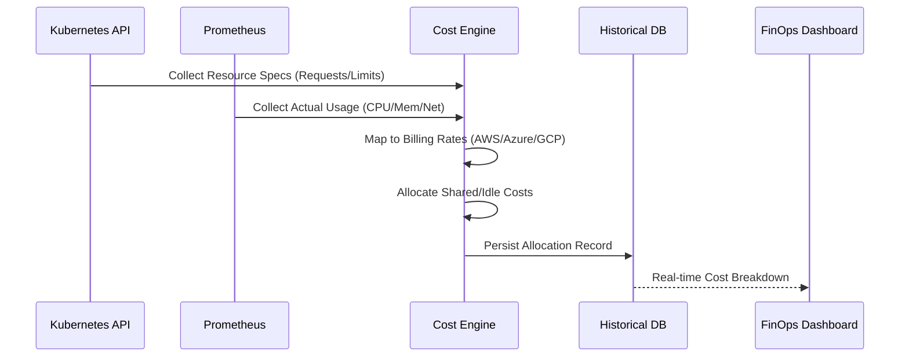

### 3. Predictive Forecasting Model
*Using historical data to predict future fiscal trends.*
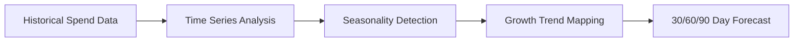

### 4. Optimization & Rightsizing Workflow
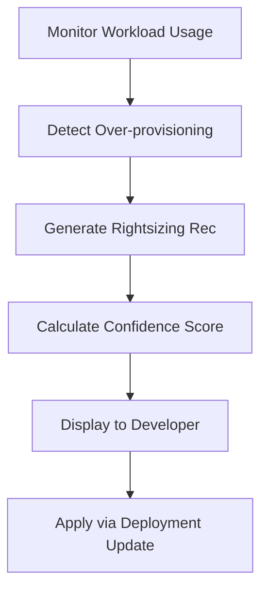

### 5. Multi-Cluster Aggregation Model
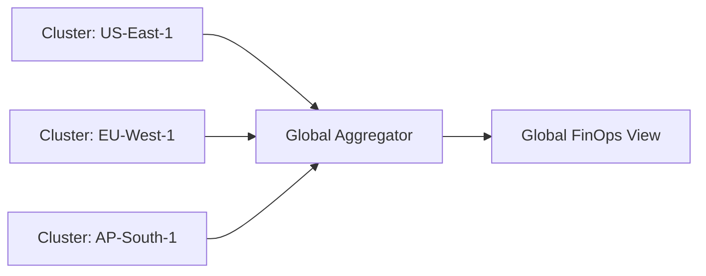

### 6. Budget Guardrails & Governance
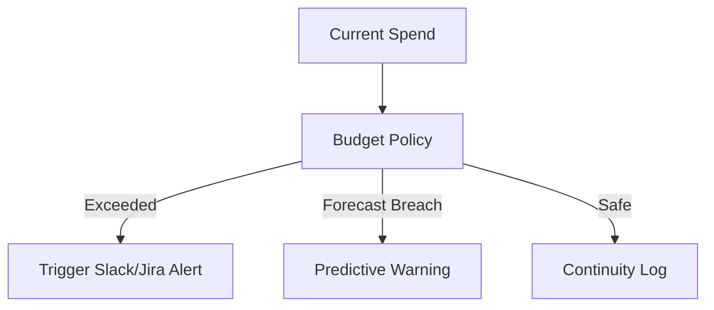

### 7. Unit Economics: Cost per Service
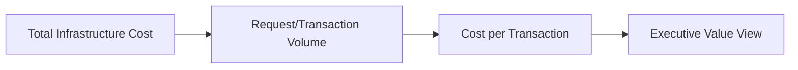

### 8. Idle Resource Detection & Cleanup
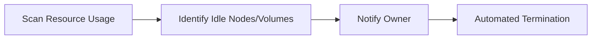

### 9. Savings Tracker & Value Realization
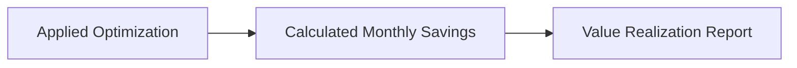

### 10. Multi-Cloud Billing Synchronization
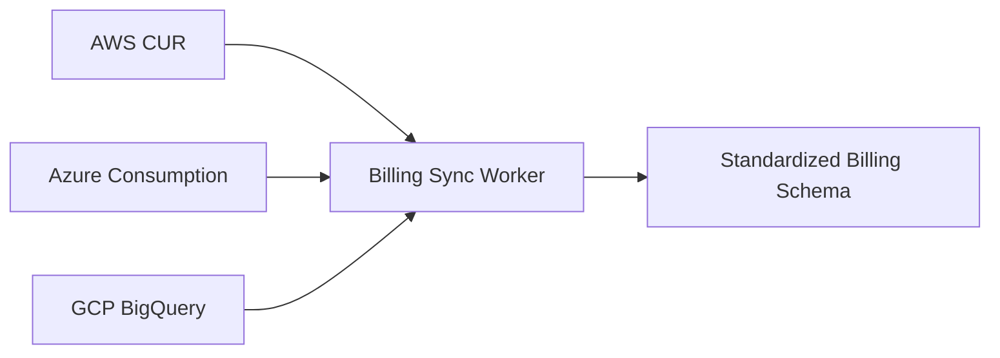

### 11. Cost visibility flow
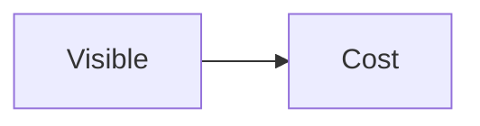

### 12. Namespace allocation flow
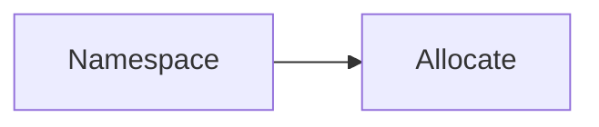

### 13. Workload cost analysis
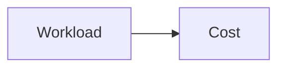

### 14. Multi-cluster aggregation
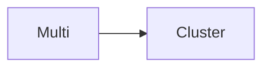

### 15. Multi-cloud cost analysis
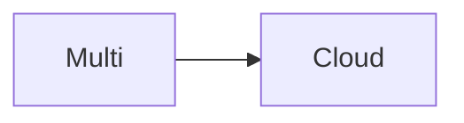

### 16. Cost anomaly detection
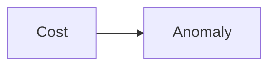

### 17. Cost forecasting flow
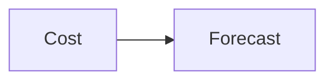

### 18. Budget tracking flow
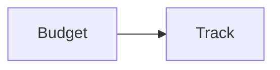

### 19. Chargeback model flow
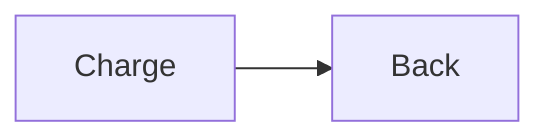

### 20. Showback model flow
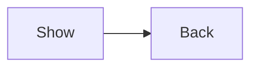

### 21. Resource utilization flow
```mermaid
graph LR
    R[Resource] --> U[Util]
```

### 22. Rightsizing recommendation
```mermaid
graph LR
    R[Right] --> S[Size]
```

### 23. Idle resource detection
```mermaid
graph LR
    I[Idle] --> D[Detect]
```

### 24. Savings tracking flow
```mermaid
graph LR
    S[Savings] --> T[Track]
```

### 25. FinOps governance flow
```mermaid
graph LR
    F[Fin] --> G[Gov]
```

### 26. Cost policy enforcement
```mermaid
graph LR
    C[Cost] --> P[Policy]
```

### 27. Executive cost report
```mermaid
graph LR
    E[Exec] --> R[Report]
```

### 28. Developer cost view
```mermaid
graph LR
    D[Dev] --> C[Cost]
```

### 29. Unit economics flow
```mermaid
graph LR
    U[Unit] --> E[Econ]
```

### 30. Cost engine pipeline
```mermaid
graph LR
    C[Cost] --> P[Pipe]
```

### 31. Optimization engine flow
```mermaid
graph LR
    O[Opti] --> E[Engine]
```

### 32. Forecast engine flow
```mermaid
graph LR
    F[Fore] --> E[Engine]
```

### 33. Analytics engine flow
```mermaid
graph LR
    A[Analy] --> E[Engine]
```

### 34. Collector: Kubernetes
```mermaid
graph LR
    C[Collect] --> K[K8s]
```

### 35. Collector: AWS
```mermaid
graph LR
    C[Collect] --> A[AWS]
```

### 36. Collector: Azure
```mermaid
graph LR
    C[Collect] --> A[Azure]
```

### 37. Collector: GCP
```mermaid
graph LR
    C[Collect] --> G[GCP]
```

### 38. Model: Allocation
```mermaid
graph LR
    M[Model] --> A[Alloc]
```

### 39. Model: Forecasting
```mermaid
graph LR
    M[Model] --> F[Fore]
```

### 40. Model: Optimization
```mermaid
graph LR
    M[Model] --> O[Opti]
```

### 41. Integration: Prometheus
```mermaid
graph LR
    I[Integrate] --> P[Prom]
```

### 42. Integration: Slack
```mermaid
graph LR
    I[Integrate] --> S[Slack]
```

### 43. Integration: Jira
```mermaid
graph LR
    I[Integrate] --> J[Jira]
```

### 44. Infrastructure: K8s
```mermaid
graph LR
    I[Infra] --> K[K8s]
```

### 45. Infrastructure: DB
```mermaid
graph LR
    I[Infra] --> D[DB]
```

### 46. Monitoring: Prometheus
```mermaid
graph LR
    M[Monitor] --> P[Prom]
```

### 47. Monitoring: Grafana
```mermaid
graph LR
    M[Monitor] --> G[Graf]
```

### 48. Monitoring: Alerts
```mermaid
graph LR
    M[Monitor] --> A[Alert]
```

### 49. CI/CD: Build
```mermaid
graph LR
    C[CICD] --> B[Build]
```

### 50. CI/CD: Test
```mermaid
graph LR
    C[CICD] --> T[Test]
```

### 51. CI/CD: Security
```mermaid
graph LR
    C[CICD] --> S[Sec]
```

### 52. CI/CD: Deploy
```mermaid
graph LR
    C[CICD] --> D[Deploy]
```

### 53. Kubecost UI: Overview
```mermaid
graph LR
    U[UI] --> O[Over]
```

### 54. Kubecost UI: Namespace
```mermaid
graph LR
    U[UI] --> N[Name]
```

### 55. Kubecost UI: Workload
```mermaid
graph LR
    U[UI] --> W[Work]
```

### 56. Kubecost UI: Forecast
```mermaid
graph LR
    U[UI] --> F[Fore]
```

### 57. Kubecost UI: Optimization
```mermaid
graph LR
    U[UI] --> O[Opti]
```

### 58. Kubecost UI: Budget
```mermaid
graph LR
    U[UI] --> B[Budg]
```

### 59. API: Cost Summary
```mermaid
graph LR
    A[API] --> S[Sum]
```

### 60. API: Optimization
```mermaid
graph LR
    A[API] --> O[Opti]
```

### 61. API: Forecast
```mermaid
graph LR
    A[API] --> F[Fore]
```

### 62. API: Budget
```mermaid
graph LR
    A[API] --> B[Budg]
```

### 63. Worker: Ingest
```mermaid
graph LR
    W[Worker] --> I[Ingest]
```

### 64. Worker: Allocation
```mermaid
graph LR
    W[Worker] --> A[Alloc]
```

### 65. Worker: Forecast
```mermaid
graph LR
    W[Worker] --> F[Fore]
```

### 66. Worker: Optimize
```mermaid
graph LR
    W[Worker] --> O[Opti]
```

### 67. Worker: Notify
```mermaid
graph LR
    W[Worker] --> N[Notify]
```

### 68. Policy: Cost
```mermaid
graph LR
    P[Policy] --> C[Cost]
```

### 69. Policy: Budget
```mermaid
graph LR
    P[Policy] --> B[Budg]
```

### 70. Policy: Governance
```mermaid
graph LR
    P[Policy] --> G[Gov]
```

### 71. Savings realize flow
```mermaid
graph LR
    S[Save] --> R[Real]
```

### 72. Efficiency score flow
```mermaid
graph LR
    E[Eff] --> S[Score]
```

### 73. Anomaly detection flow
```mermaid
graph LR
    A[Anom] --> D[Det]
```

### 74. Chargeback workflow
```mermaid
graph LR
    C[Charge] --> W[Work]
```

### 75. State management flow
```mermaid
graph LR
    S[State] --> M[Manage]
```

### 76. Telemetry ingestion
```mermaid
graph LR
    T[Tele] --> I[Ingest]
```

### 77. Billing standardization
```mermaid
graph LR
    B[Bill] --> S[Stand]
```

### 78. Resource tagging Strategy
```mermaid
graph LR
    R[Res] --> T[Tag]
```

### 79. FinOps maturity score
```mermaid
graph LR
    F[Fin] --> M[Mat]
```

### 80. Value realization model
```mermaid
graph LR
    V[Val] --> R[Real]
```

---

## 🛠️ Technical Stack & Implementation

### Cost & Allocation Engine
- **Processing**: Python 3.11+ / FastAPI / Pandas
- **Telemetry**: Prometheus (CPU/Mem usage), Kubernetes API (Resource Specs).
- **Billing**: Multi-cloud provider billing exports (AWS CUR, Azure Consumption, GCP BigQuery).

### Frontend (FinOps Dashboard)
- **Framework**: React 18 / Vite
- **Visuals**: Recharts (Spend Trends, Allocation Pies, Forecast Arcs).
- **Theme**: Emerald, Slate, and Gold (Financial Trust Aesthetics).

### Infrastructure
- **Cloud**: AWS, Azure, GCP.
- **Security**: OIDC Identity, FinOps RBAC.

---

## 🚀 Deployment Guide

### Local Development
```bash
# Clone the repository
git clone https://github.com/devopstrio/kubecost-enterprise.git
cd kubecost-enterprise

# Setup environment
cp .env.example .env

# Launch services
make up
```
Access the FinOps Dashboard at `http://localhost:3000`.

---

## 📜 License
Distributed under the MIT License. See `LICENSE` for more information.
