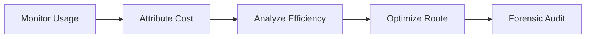
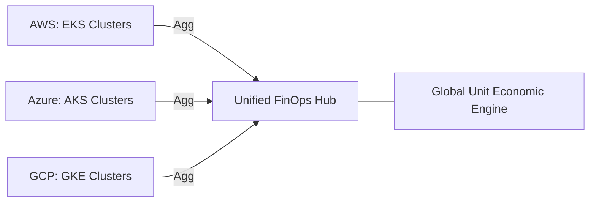
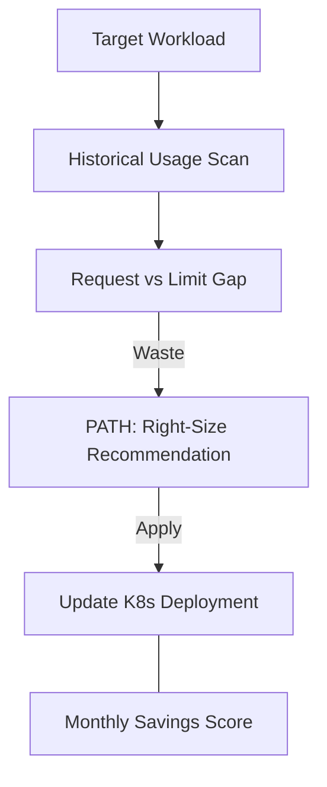
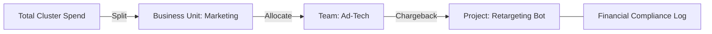
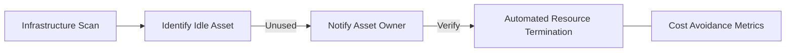
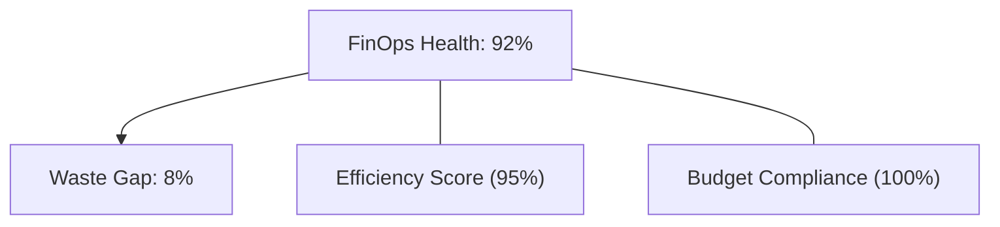
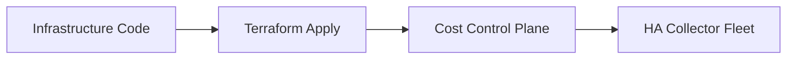
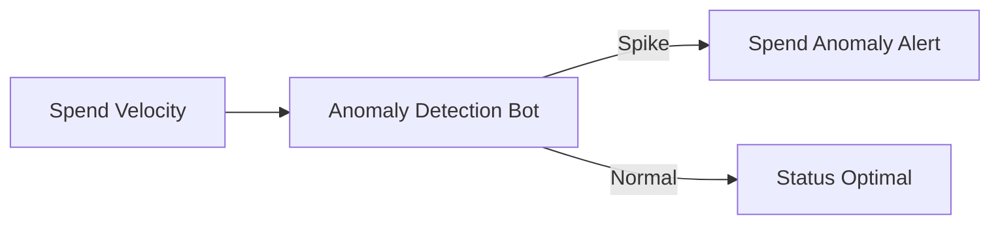
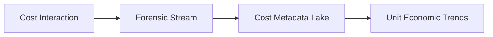

<div align="center">


<h1>Kubecost Enterprise</h1>

<p><strong>The Institutional-Grade Platform for Kubernetes Cost Intelligence, FinOps Governance, and Multi-Cloud Cloud-Native Optimization.</strong></p>

[]()
[]()
[]()

<br/>

> **"Visibility is the first step toward optimization."** 
> **Kubecost Enterprise** is an enterprise-grade platform designed to provide a secure, measurable, and highly automated foundation for global FinOps operations. It orchestrates the complex lifecycle of Kubernetes costs—from namespace-level attribution and resource right-sizing to multi-cluster aggregation and unified cloud-native cost governance.

</div>

---

## 🏛️ Executive Summary

Fragmented Kubernetes spending and manual cost allocation processes are strategic operational liabilities; lack of centralized cost orchestration is a primary barrier to organizational unit economic maturity. Organizations fail to achieve rapid cloud-native ROI not because of a lack of tools, but because of fragmented cost standards, lack of automated right-sizing validation, and an inability to orchestrate cluster spend with operational precision.

This platform provides the **Cost Intelligence Plane**. It implements a complete **Enterprise Kubecost-as-Code Framework**, enabling FinOps and Platform teams to manage global Kubernetes investments as first-class citizens. By automating the identification of idle resources through usage analysis and orchestrating real-time right-sizing recommendations, we ensure that every organizational workload—from critical production microservices to routine development sandboxes—is cost-optimized by default, audited for history, and strictly aligned with institutional FinOps frameworks.

---

## 📐 Architecture Storytelling: Principal Reference Models

### 1. Principal Architecture: Global K8s Cost Optimization & Intelligence Plane
This diagram illustrates the end-to-end flow from multi-cluster telemetry and billing ingestion to resource right-sizing, cost allocation, and institutional FinOps auditing.

```mermaid
graph LR
    %% Subgraph Definitions
    subgraph CostIngress["Multi-Cluster & Billing Ingress"]
        direction TB
        EKS_AKS_GKE["Cloud K8s Clusters"]
        OnPrem_K8s["On-Prem K8s Fleet"]
        CloudBilling["Cloud Provider Billing (CUR)"]
    end

    subgraph IntelligenceEngine["Cost Intelligence Hub"]
        direction TB
        API["FastAPI Cost Gateway"]
        AllocationEngine["Namespace & Label Allocator"]
        RightSizeEngine["Resource Right-Sizer"]
        ForecastingBot["Predictive Spend Forecaster"]
    end

    subgraph OptimizationPlane["Distributed Optimization Fleet"]
        direction TB
        RightSizeWorkers["Right-Sizing Recommenders"]
        IdleReclaimers["Idle Resource Reclaimers"]
        AuditFeed["Real-Time Spend Aggregator"]
    end

    subgraph OperationsHub["Institutional FinOps Hub"]
        direction TB
        Scorecard["K8s Frugality Score"]
        Analytics["Spend & Efficiency Stats"]
        Audit["Forensic Cost Metadata Lake"]
    end

    subgraph DevOps["Kubecost-as-Code Framework"]
        direction TB
        TF["Terraform Cost Modules"]
        PolicyBot["Automated Budget Enforcer"]
        ChatOps["Spend Approval Hub"]
    end

    %% Flow Arrows
    CostIngress -->|1. Submit Telemetry| API
    API -->|2. Allocate Costs| AllocationEngine
    AllocationEngine -->|3. Identify Waste| RightSizeEngine
    RightSizeEngine -->|4. Forecast Spend| ForecastingBot
    
    ForecastingBot -->|5. Execute Optimization| OptimizationPlane
    OptimizationPlane -->|6. Notify Savings| ChatOps
    API -->|7. Visualize ROI| Scorecard
    
    Scorecard -->|8. Track Efficiency| Analytics
    Scorecard -->|9. Record Budget| Audit
    
    TF -->|10. Provision Hub| IntelligenceEngine
    PolicyBot -->|11. Inject Budget Policy| ForecastingBot
    Audit -->|12. Improve Allocation| AllocationEngine

    %% Styling
    classDef ingress fill:#f5f5f5,stroke:#616161,stroke-width:2px;
    classDef intel fill:#e8eaf6,stroke:#1a237e,stroke-width:2px;
    classDef optimization fill:#e1f5fe,stroke:#01579b,stroke-width:2px;
    classDef ops fill:#ede7f6,stroke:#311b92,stroke-width:2px;
    classDef devops fill:#e8f5e9,stroke:#1b5e20,stroke-width:2px;

    class CostIngress ingress;
    class IntelligenceEngine intel;
    class OptimizationPlane optimization;
    class OperationsHub ops;
    class DevOps devops;
```



### 2. The K8s Cost Lifecycle Flow
The continuous path of a Kubernetes cost from initial usage monitoring and attribution to active efficiency analysis, right-sizing optimization, and institutional forensic auditing.



### 3. Multi-Cluster Cost Aggregation Topology
Strategically centralizing costs across EKS, GKE, AKS, and on-premises clusters, providing a unified institutional view of global cloud-native spend and efficiency.



### 4. Resource Right-sizing & Recommendation Flow
Executing complex logic for identifying over-provisioned pods and nodes, providing data-driven recommendations for optimal resource limits to protect institutional margins.



### 5. Distributed Cost Allocation & Chargeback Flow
Mapping complex Kubernetes shared costs (Idle, System, Common Services) to Business Units, Teams, and Projects, ensuring 100% institutional cost transparency.



### 6. Idle Resource Identification & Reclamation Flow
Automatically detecting unused nodes, unattached persistent volumes, and dormant namespaces across the fleet, enabling rapid institutional resource reclamation.



### 7. Institutional K8s Frugality Scorecard
Grading organizational performance based on key indicators: Right-sizing Adoption Rate, Cluster Efficiency Score, and Cost Per Request Unit Economics.



### 8. Identity & RBAC for Cost Governance
Managing fine-grained access to cost dashboards, right-sizing triggers, and budget audits between FinOps Analysts, Cluster Admins, and Finance Officers.

```mermaid
TD
    Analyst["FinOps Analyst"] --> Hub["Observe Global Spend"]
    Admin["Cluster Admin"] --> Opti["Execute Right-Sizing"]
    Officer["Finance Officer"] --> Audit["Verify ROI & Chargeback"]
```

### 9. IaC Deployment: Kubecost-as-Code Framework
Using modular Terraform to deploy and manage the versioned distribution of the cost tracking hubs, optimization workers, and forensic metadata lakes.



### 10. AIOps Spend Anomaly & Volume Spike Validation Flow
Using advanced analytics to identify sudden surges in egress costs, spot-instance evictions, or rogue application behavior that could result in exponential spend.



### 11. Metadata Lake for Forensic Cost Audit
Storing long-term records of every pod cost, every efficiency score, and every savings recommendation for institutional record-keeping, compliance auditing, and post-spend forensics.



---

## 🏛️ Core FinOps Pillars

1.  **Unified Spend Coordination**: Maximizing ROI by centralizing all cluster costs through a single institutional plane.
2.  **Automated Right-sizing Validation**: Eliminating waste through proactive usage-to-limit gap analysis.
3.  **Sequential Allocation Intelligence**: Ensuring 100% cost attribution through dependency-aware shared cost splitting.
4.  **Zero-Waste Resource Protection**: Automatically identifying and reclaiming idle infrastructure across the enterprise.
5.  **Autonomous Spend Protection**: Identifying and containing rogue applications before they deplete organizational budgets.
6.  **Full Cost Auditability**: Immutable recording of every allocation and savings event for institutional forensics.

---

## 🛠️ Technical Stack & Implementation

### Cost Engine & APIs
*   **Framework**: Python 3.11+ / FastAPI.
*   **Cost Core**: Custom Python-based logic for resource allocation and right-sizing analysis.
*   **Billing Hub**: Integration with AWS CUR, Azure Consumption, and GCP BigQuery APIs.
*   **Persistence**: PostgreSQL (Cost Ledger) and Redis (Live Job State).
*   **Auth Orchestrator**: Federated OIDC/SAML for least-privilege cost management access.

### FinOps Dashboard (UI)
*   **Framework**: React 18 / Vite.
*   **Theme**: Dark, Indigo, Slate (Modern high-fidelity FinOps aesthetic).
*   **Visualization**: D3.js for allocation maps and Recharts for spend velocity analytics.

### Infrastructure & DevOps
*   **Runtime**: AWS EKS or Azure Kubernetes Service (AKS) for management plane.
*   **Telemetry Plane**: Managed Prometheus (AMP) or Datadog for usage ingestion.
*   **IaC**: Modular Terraform for deploying the cost landing zone and collector fleet.

---

## 🏗️ IaC Mapping (Module Structure)

| Module | Purpose | Real Services |
| :--- | :--- | :--- |
| **`infrastructure/cost_hub`** | Central management plane | EKS, PostgreSQL, Redis |
| **`infrastructure/collectors`** | Multi-cluster telemetry fleet | Prometheus, K8s API |
| **`infrastructure/connectors`** | Cloud Billing API adapters | AWS CUR, Azure Sync |
| **`infrastructure/auditing`** | Forensic cost sinks | S3, Athena, Quicksight |

---

## 🚀 Deployment Guide

### Local Principal Environment
```bash
# Clone the cost platform
git clone https://github.com/devopstrio/kubecost-enterprise.git
cd kubecost-enterprise

# Configure environment
cp .env.example .env

# Launch the Cost stack
make init

# Trigger a mock cost allocation and right-sizing simulation
make simulate-cost
```

Access the FinOps Dashboard at `http://localhost:3000`.

---

## 📜 License
Distributed under the MIT License. See `LICENSE` for more information.

---
<div align="center">
  <p>© 2026 Devopstrio. All rights reserved.</p>
</div>
