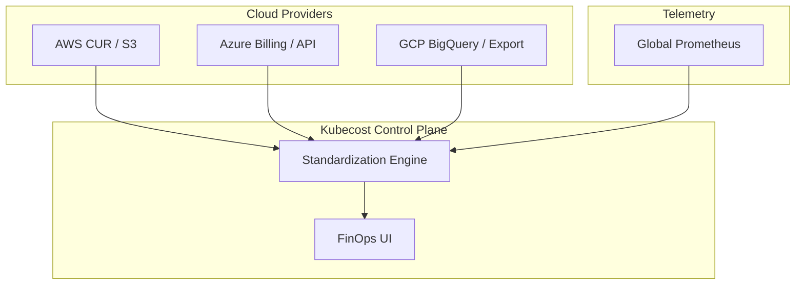
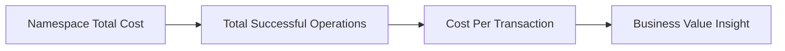
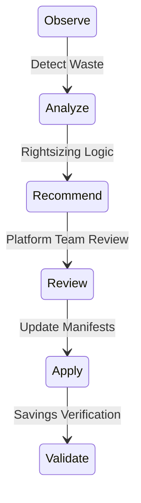

# Architecture & FinOps Diagrams

## 11. Multi-Cloud Billing Topology (Detailed)
*How the platform standardizes disparate billing data.*

## 13. "Unit Economics" Calculation Model

## 20. Automated Optimization Lifecycle

