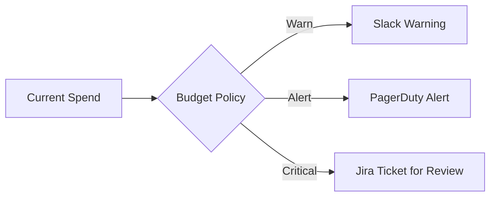
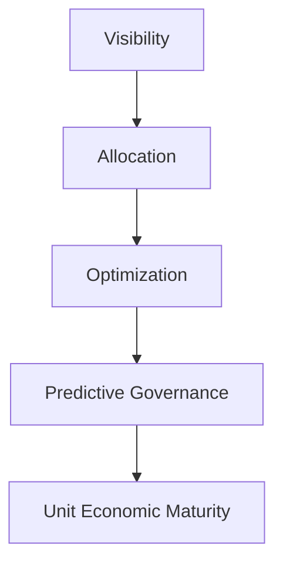

# Governance & Policy Diagrams

## 31. Budget Guardrail Enforcement

```mermaid
graph LR
    Spend[Current Spend] --> Policy{Budget Policy}
    Policy -->|Warn| Slack[Slack Warning]
    Policy -->|Alert| Pager[PagerDuty Alert]
    Policy -->|Critical| Jira[Jira Ticket for Review]
```

## 34. FinOps Maturity Model

```mermaid
graph TD
    Level1[Visibility] --> Level2[Allocation]
    Level2 --> Level3[Optimization]
    Level3 --> Level4[Predictive Governance]
    Level4 --> Level5[Unit Economic Maturity]
```

## 40. Savings Realization Tracking

```mermaid
graph LR
    Action[Resource Rightsized] --> Tracking[Savings Engine]
    Tracking --> Ledger[Historical Savings Ledger]
    Ledger --> Report[Annual Value Report]
```
